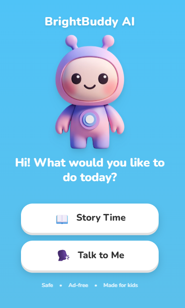
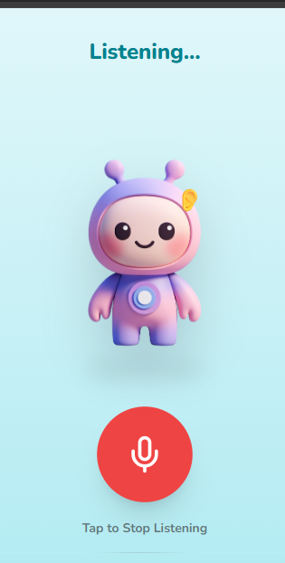

# BrightBuddy AI

BrightBuddy AI is a fun, interactive, and voice-enabled companion for children. It listens, understands, and replies in a friendly, engaging voice, making it a perfect digital buddy for storytelling and conversation.

## 🚀 Features

- **Voice-to-Voice Interaction**: Seamless speech-to-text and text-to-speech capabilities.
- **Kid-Friendly Personality**: "Pika" - a warm, enthusiastic, and Hindi-speaking (or Hinglish) companion.
- **Story Time & Talk to Me**: Different modes for engagement.
- **Safe & Ad-free**: Designed specifically for a safe child experience.
- **Interactive UI**: Beautiful, playful animations and easy-to-use interface.

## 🛠 Tech Stack

- **Framework**: [Next.js](https://nextjs.org/)
- **Frontend**: React, Tailwind CSS, Framer Motion, Lucide React
- **AI & Speech Services**:
  - **LLM**: [Groq](https://groq.com/) (Llama 3.1 8B Instant)
  - **Speech-to-Text (STT)**: Microsoft Azure Cognitive Services
  - **Text-to-Speech (TTS)**: Microsoft Azure Cognitive Services

## 📸 Screenshots

| Home Screen | Listening Mode | Permission Modal |
|:---:|:---:|:---:|
|  |  |  |

## 📦 Getting Started

1.  **Clone the repository**:
    ```bash
    git clone https://github.com/nilesh-kawar/brightbuddy-ai.git
    cd brightbuddy-ai
    ```

2.  **Install dependencies**:
    ```bash
    npm install
    # or
    yarn install
    ```

3.  **Set up Environment Variables**:
    Create a `.env.local` file in the root directory and add the following keys:
    ```env
    GROQ_API_KEY=your_groq_api_key
    AZURE_SPEECH_KEY=your_azure_speech_key
    AZURE_SPEECH_REGION=your_azure_region
    ```

4.  **Run the development server**:
    ```bash
    npm run dev
    ```

5.  Open [http://localhost:3000](http://localhost:3000) with your browser to see the result.

## 🤝 Contributing

Contributions are welcome! Please feel free to submit a Pull Request.